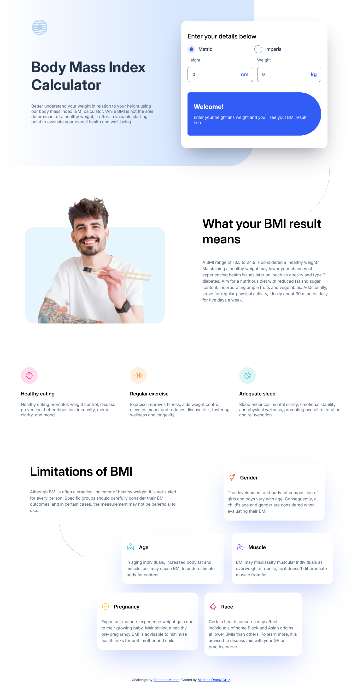
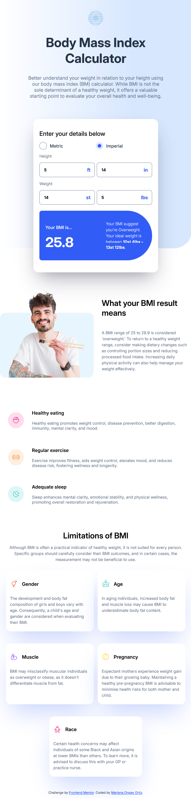
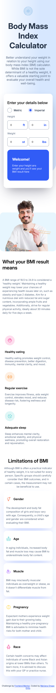

# Frontend Mentor - Body Mass Index Calculator solution

Solution to the [Body Mass Index Calculator challenge on Frontend Mentor](https://www.frontendmentor.io/challenges/body-mass-index-calculator-brrBkfSz1T).

## Overview

### The challenge

Users should be able to:

- Select whether they want to use metric or imperial units
- Enter their height and weight
- See their BMI result, with their weight classification and healthy weight range
- View the optimal layout for the interface depending on their device's screen size
- See hover and focus states for all interactive elements on the page

## Screenshot

Design

Tablet

Mobile

### Comandos

    npm install

    npm install -g sass

    sass scss/styles.scss css/styles.css

    sass --watch scss:css

## Author

- Website - Mariana Ongay Ortiz
- Frontend Mentor - [@MarianaOngay17](https://www.frontendmentor.io/profile/MarianaOngay17)
